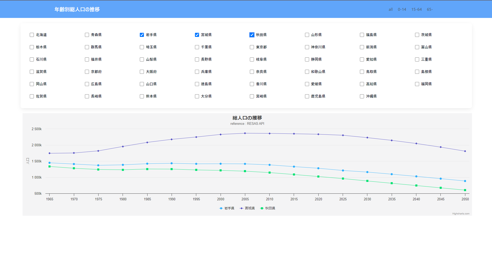
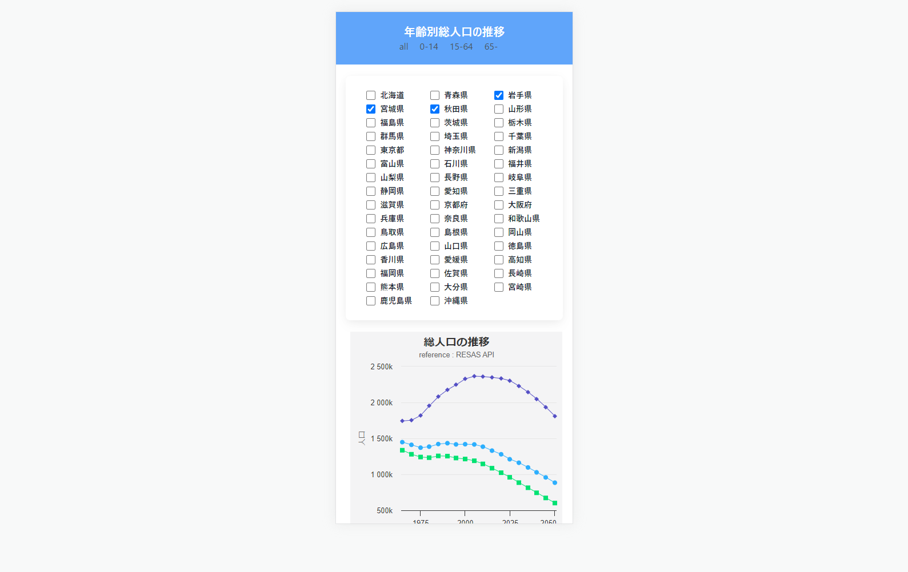

# Deploy URL is [Here](https://starlit-cobbler-9bc588.netlify.app/)

---

# Frame works, API

- [React](https://github.com/facebook/create-react-app)
- [Tailwindcss](https://tailwindcss.com/docs/guides/create-react-app)
- [highcharts-react](https://github.com/highcharts/highcharts-react)
- [RESAS API](https://opendata.resas-portal.go.jp/)
